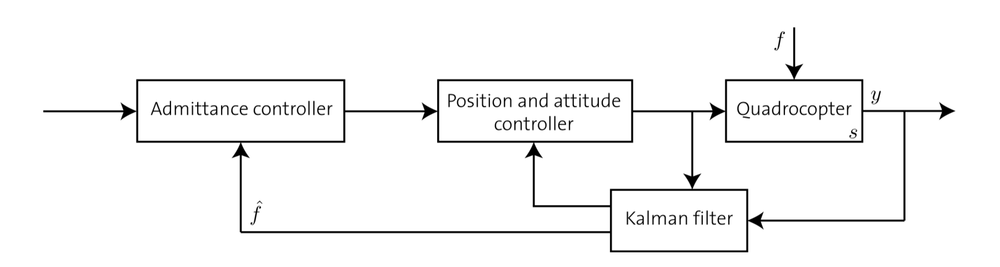
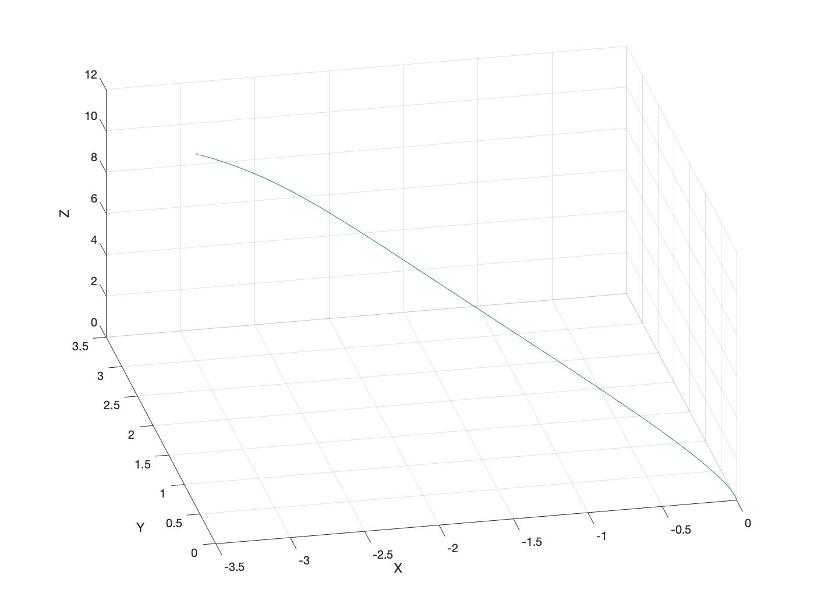
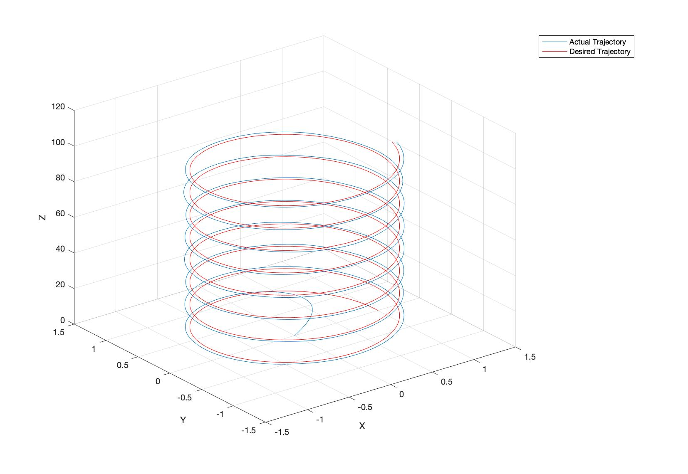
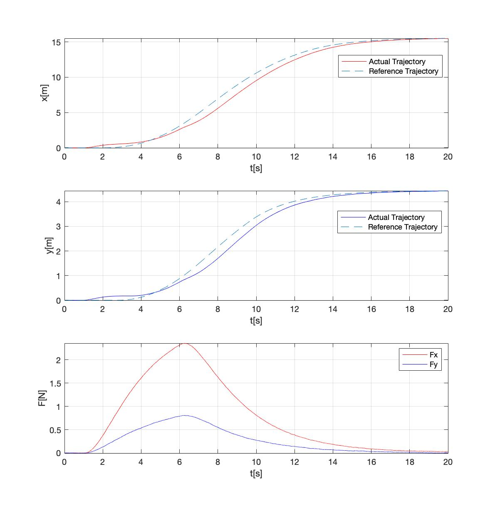
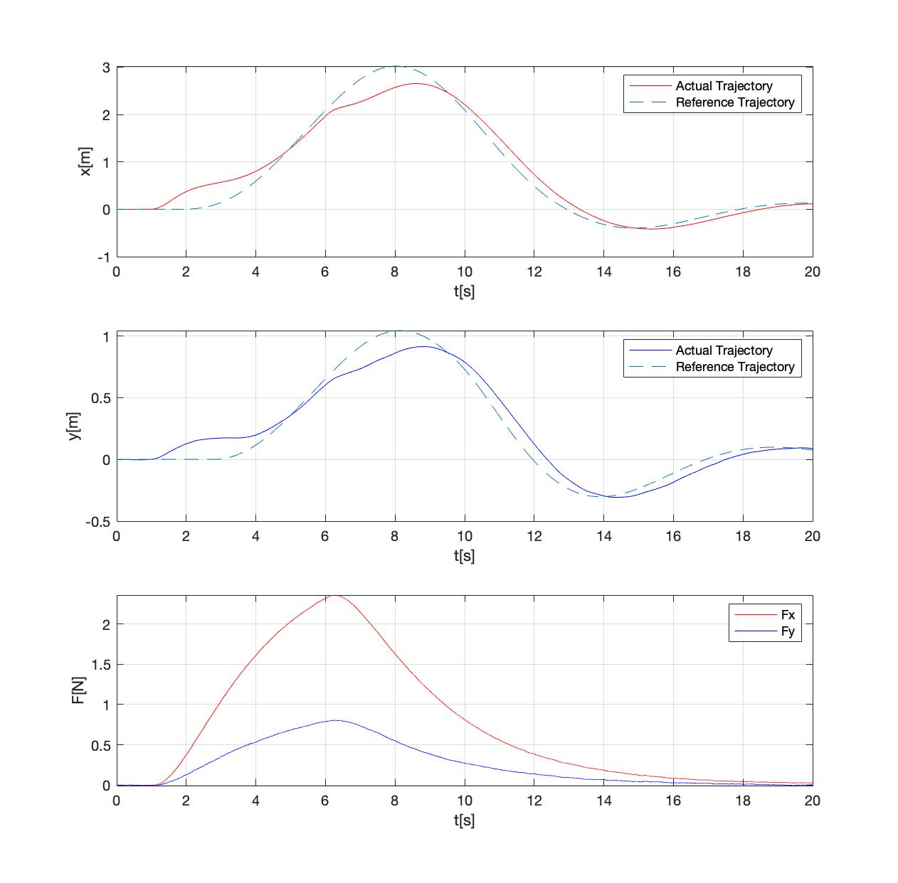
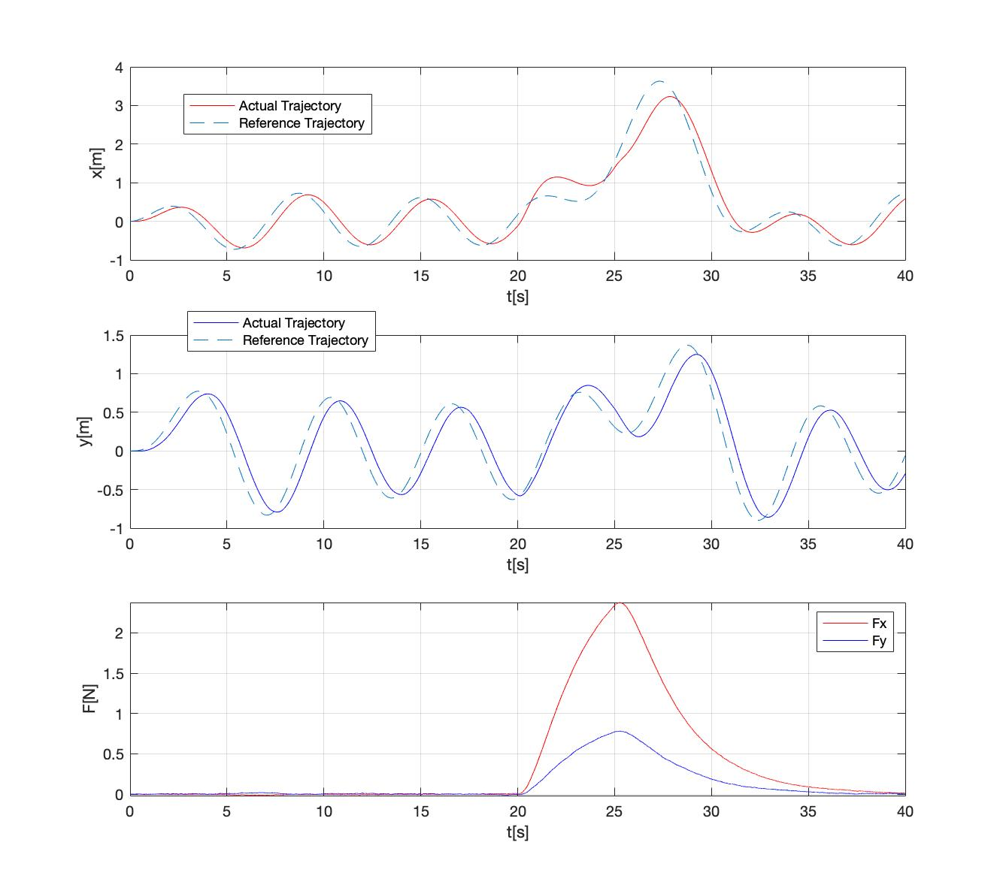

# Admittance - Control (Human - Quadcopter)
This project analyzes the suitability of applying an Admittance Control strategy for the interaction between a Human and a Quadcopter. This strategy allows users to define a desired behaviour to the robot when interaction happens.  

The forces applied to the system are estimated from the position and orientation information coming from the vehicles sensors, inputed to the Admittance Controller, that will respectively modify the reference trajectory to accommodate this force. This trajectory is then tracked by an underlying Position and Attitude Controller that is built with a Backstepping approach for the specific case of near-hover conditions.   

The strategy used is followed by simulations that show the method is applicable for such task.  

